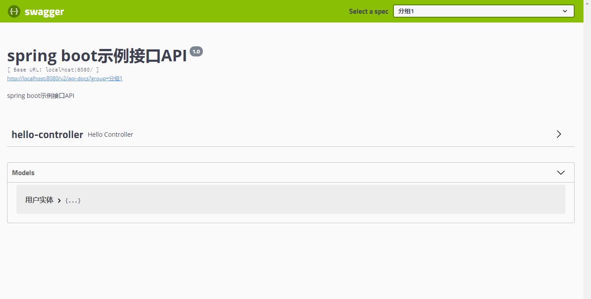
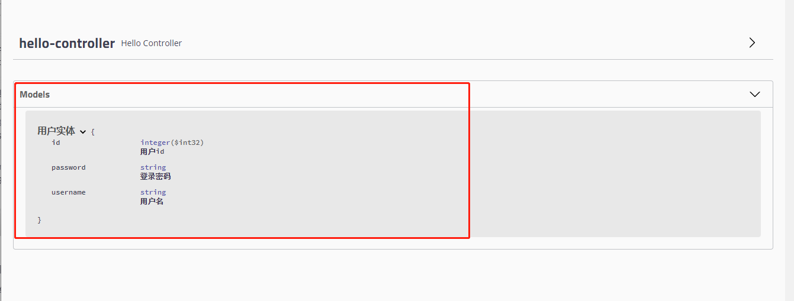

## Swagger 文档

   简介：Swagger 是一个规范和完整的框架，用于生成、描述、调用和可视化 RESTful 风格的 Web 服务。
   
   作用：通过swagger可以动态的生成API接口规范，类似于postman请求进行使用，提高开发效率。
   
## SpringBoot整合swagger框架

1. 环境搭建

    - 导入相关依赖
    
    ```xml
    <?xml version="1.0" encoding="UTF-8"?>
    <project xmlns="http://maven.apache.org/POM/4.0.0" xmlns:xsi="http://www.w3.org/2001/XMLSchema-instance"
             xsi:schemaLocation="http://maven.apache.org/POM/4.0.0 https://maven.apache.org/xsd/maven-4.0.0.xsd">
        <modelVersion>4.0.0</modelVersion>
        <parent>
            <groupId>org.springframework.boot</groupId>
            <artifactId>spring-boot-starter-parent</artifactId>
            <version>2.3.4.RELEASE</version>
            <relativePath/> <!-- lookup parent from repository -->
        </parent>
        <groupId>com.Ryan</groupId>
        <artifactId>swagger</artifactId>
        <version>0.0.1-SNAPSHOT</version>
        <name>swagger</name>
        <description>Demo project for Spring Boot</description>
    
        <properties>
            <java.version>1.8</java.version>
        </properties>
    
        <dependencies>
            <dependency>
                <groupId>org.springframework.boot</groupId>
                <artifactId>spring-boot-starter</artifactId>
            </dependency>
    
            <dependency>
                <groupId>org.springframework.boot</groupId>
                <artifactId>spring-boot-starter-test</artifactId>
                <scope>test</scope>
                <exclusions>
                    <exclusion>
                        <groupId>org.junit.vintage</groupId>
                        <artifactId>junit-vintage-engine</artifactId>
                    </exclusion>
                </exclusions>
            </dependency>
    
            <!-- 添加springfox-swagger2 依赖 -->
            <dependency>
                <groupId>io.springfox</groupId>
                <artifactId>springfox-swagger2</artifactId>
                <version>2.9.2</version>
            </dependency>
    
            <!-- swagger-ui 可视化界面 -->
            <dependency>
                <groupId>io.springfox</groupId>
                <artifactId>springfox-swagger-ui</artifactId>
                <version>2.9.2</version>
            </dependency>
    
            <!-- 引入swagger-bootstrap-ui包 请求路径http://localhost:8080/doc.html-->
            <dependency>
                <groupId>com.github.xiaoymin</groupId>
                <artifactId>swagger-bootstrap-ui</artifactId>
                <version>1.9.1</version>
            </dependency>
    
            <!-- 引入swagger-ui-layer包 请求路径http://localhost:8080/docs.html-->
            <dependency>
                <groupId>com.github.caspar-chen</groupId>
                <artifactId>swagger-ui-layer</artifactId>
                <version>1.1.3</version>
            </dependency>
    
            <!-- web 依赖 -->
            <dependency>
                <groupId>org.springframework.boot</groupId>
                <artifactId>spring-boot-starter-web</artifactId>
            </dependency>
    
            <!--        配置lombok依赖-->
            <dependency>
                <groupId>org.projectlombok</groupId>
                <artifactId>lombok</artifactId>
                <optional>true</optional>
            </dependency>
    
        </dependencies>
    
        <build>
            <plugins>
                <plugin>
                    <groupId>org.springframework.boot</groupId>
                    <artifactId>spring-boot-maven-plugin</artifactId>
                </plugin>
            </plugins>
        </build>
    
    </project>

    ```
   
    - Java配置
    
    ```java
    package com.ryan.swagger.config;
    
    import com.fasterxml.classmate.TypeResolver;
    import org.springframework.beans.factory.annotation.Autowired;
    import org.springframework.context.annotation.Bean;
    import org.springframework.context.annotation.Configuration;
    import org.springframework.core.env.Environment;
    import org.springframework.core.env.Profiles;
    import springfox.documentation.builders.ApiInfoBuilder;
    import springfox.documentation.builders.PathSelectors;
    import springfox.documentation.builders.RequestHandlerSelectors;
    import springfox.documentation.service.ApiInfo;
    import springfox.documentation.spi.DocumentationType;
    import springfox.documentation.spring.web.plugins.Docket;
    import springfox.documentation.swagger2.annotations.EnableSwagger2;
    
    @Configuration
    @EnableSwagger2         //启用Swagger2
    public class MySwaggerConfig {
    
        @Autowired
        private TypeResolver typeResolver;
    
        /**
         * swagger的实例bean是docket
         *
         * @param environment
         * @return
         */
        @Bean
        public Docket createRestApi(Environment environment) {
    
            // 设置要显示swagger的环境
            Profiles of = Profiles.of("dev", "test");
    
            // 判断当前是否处于该环境
            // 通过 enable() 接收此参数判断是否要显示
            boolean b = environment.acceptsProfiles(of);
    
            return new Docket(DocumentationType.SWAGGER_2)
                    .groupName("分组1")
                    .apiInfo(apiInfo())
                    .enable(b)           //配置是否启用Swagger，如果是false，在浏览器将无法访问
                    .select()            // 通过.select()方法，去配置扫描接口,RequestHandlerSelectors配置如何扫描接口
                    .apis(RequestHandlerSelectors
                            .basePackage("com.ryan.swagger.controller"))
                    .paths(PathSelectors.any()).build();
        }   
    
        /**
         * 通过ApiInfo进行配置文档信息
         *
         * @return
         */
        private ApiInfo apiInfo() {
            return new ApiInfoBuilder()
                    .title("spring boot示例接口API")
                    .description("spring boot示例接口API")
                    .version("1.0").build();
        }
    }
    ```
   
    - 测试搭建的环境
    
    ```http request
    http://localhost:8080/swagger-ui.html
    ```
    - 搭建成功
    
    
    
2. 配置swagger

    - 配置扫描接口
    
    ```java
    new Docket(DocumentationType.SWAGGER_2)
   .apis(RequestHandlerSelectors.basePackage("com.ryan.swagger.controller"))
    ```
    
    - 配置开关（生产环境中要将enable置为false，减少内存开销）
    
    ```java
   
   //方法一
   new Docket(DocumentationType.SWAGGER_2)
   .apis(RequestHandlerSelectors.basePackage("com.ryan.swagger.controller"))
   .enable(true)
   
   //方法二
   // 设置要显示swagger的环境
   Profiles of = Profiles.of("dev", "test");

   // 判断当前是否处于该环境
   // 通过 enable() 接收此参数判断是否要显示
   boolean b = environment.acceptsProfiles(of);

   return new Docket(DocumentationType.SWAGGER_2)
           .groupName("分组1")
           .apiInfo(apiInfo())
           //.additionalModels(typeResolver.resolve(User.class))
           .enable(b)        ////配置是否启用Swagger，如果是false，在浏览器将无法访问
    ```
    
    - 配置swagger分组
    
    ```java
    /**
     * swagger的实例bean是docket
     *
     * @param environment
     * @return
     */
    @Bean
    public Docket createRestApi(Environment environment) {

        // 设置要显示swagger的环境
        Profiles of = Profiles.of("dev", "test");

        // 判断当前是否处于该环境
        // 通过 enable() 接收此参数判断是否要显示
        boolean b = environment.acceptsProfiles(of);

        return new Docket(DocumentationType.SWAGGER_2)
                .groupName("分组1")
                .apiInfo(apiInfo())
                //.additionalModels(typeResolver.resolve(User.class))
                .enable(b)        ////配置是否启用Swagger，如果是false，在浏览器将无法访问
                .select()            // 通过.select()方法，去配置扫描接口,RequestHandlerSelectors配置如何扫描接口
                .apis(RequestHandlerSelectors
                        .basePackage("com.ryan.swagger.controller"))
                .paths(PathSelectors.any()).build();
    }

    /**
     * 配置多个分组
     *
     * @param environment
     * @return
     */
    @Bean
    public Docket createRestApi2(Environment environment) {

        // 设置要显示swagger的环境
        Profiles of = Profiles.of("dev", "test");

        // 判断当前是否处于该环境
        // 通过 enable() 接收此参数判断是否要显示
        boolean b = environment.acceptsProfiles(of);

        return new Docket(DocumentationType.SWAGGER_2)
                .groupName("分组2")
                .apiInfo(apiInfo())
                .enable(b)        ////配置是否启用Swagger，如果是false，在浏览器将无法访问
                .select()            // 通过.select()方法，去配置扫描接口,RequestHandlerSelectors配置如何扫描接口
                .apis(RequestHandlerSelectors
                        .basePackage("com.ryan.swagger.controller"))
                .paths(PathSelectors.any()).build();
    }
    ```
   
    **有多少个分组就创建多少个docket的bean**
    
    - 配置实体（显示为models）
    
    ```java
    package com.ryan.swagger.entity;
    
    import io.swagger.annotations.ApiModel;
    import io.swagger.annotations.ApiModelProperty;
    import lombok.AllArgsConstructor;
    import lombok.Data;
    import lombok.NoArgsConstructor;
    
    @Data
    @NoArgsConstructor
    @AllArgsConstructor
    @ApiModel("用户实体")
    public class User {
    
        @ApiModelProperty("用户id")
        private Integer id;
    
        @ApiModelProperty("用户名")
        private String username;
    
        @ApiModelProperty("登录密码")
        private String password;
    }
    ```
   
    效果显示
    
    
    
    - 常用注解
    
   **@ApiModel** : 解释说明表名
       
   **@ApiModelProperty** : 解释说明属性
   
   ```java
    @ApiModel("用户实体")
    public class User {
    
        @ApiModelProperty("用户id")
        private Integer id;
    
        @ApiModelProperty("用户名")
        private String username;
    
        @ApiModelProperty("登录密码")
        private String password;
    }
   ```   
   **ApiOperation** 接口说明
   
   **ApiOperation** 请求参数说明
   
    ```java
    @ApiOperation("hello接口说明")
    @GetMapping("/hello")
    public Object hello(@ApiParam("用户名") @RequestParam String username) {
        User user = new User();
        user.setUsername(username);
        return user;
    }
    ```
  
3. 扩展

    - 主题更换
    
        配置依赖
        
        ```xml
        <!-- 引入swagger-bootstrap-ui包 请求路径http://localhost:8080/doc.html-->
                <dependency>
                    <groupId>com.github.xiaoymin</groupId>
                    <artifactId>swagger-bootstrap-ui</artifactId>
                    <version>1.9.1</version>
                </dependency>
        
                <!-- 引入swagger-ui-layer包 请求路径http://localhost:8080/docs.html-->
                <dependency>
                    <groupId>com.github.caspar-chen</groupId>
                    <artifactId>swagger-ui-layer</artifactId>
                    <version>1.1.3</version>
                </dependency>
        ```
      
        请求测试
        
        ```http request
        http://localhost:8080/doc.html
      
        http://localhost:8080/docs.html
        ```